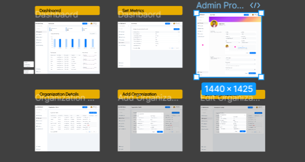

# 📊 Performance Management System  

A **web-based platform** designed to track, evaluate, and improve employee performance through key performance indicators (KPIs) and analytics. Built using the **MERN stack** (MongoDB, Express, React, and Node.js).  

## 🚀 Features  
- ✅ **Employee Performance Tracking**  
- 📊 **Dashboard with Analytics & Insights**  
- 🏆 **Set & Evaluate KPIs**  
- 🔄 **Real-Time Feedback & Reviews**  
- 👥 **User Roles: Admin & Employee**  
- 📅 **Performance Reports & History**  

## 🛠️ Tech Stack  
- **Frontend**: React, Redux, TailwindCSS  
- **Backend**: Node.js, Express.js, MongoDB  
- **Authentication**: JWT (JSON Web Token)  
- **Database**: MongoDB  

   

### 1️⃣ Clone the Repository  
```sh
git clone https://github.com/yourusername/performance-management-system.git
cd performance-management-system

